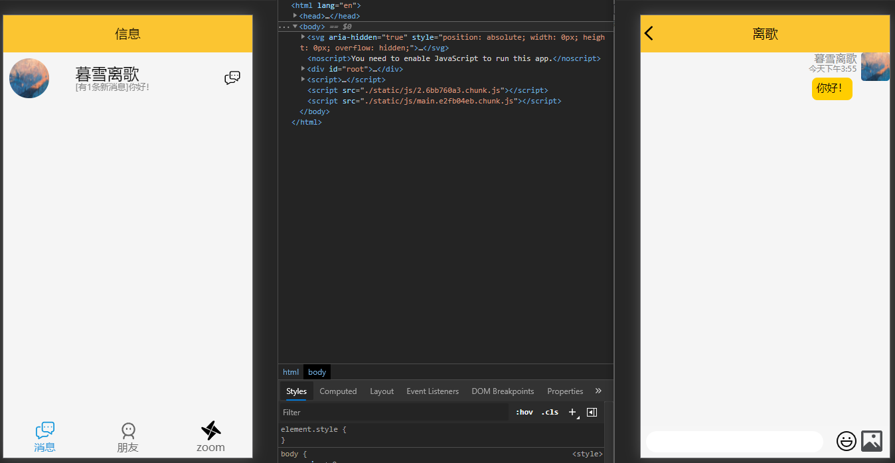
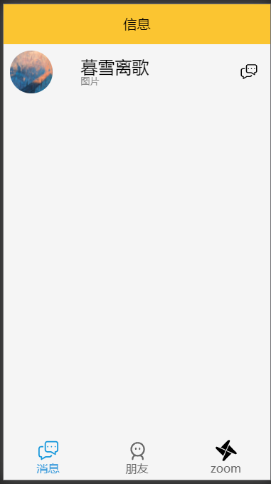
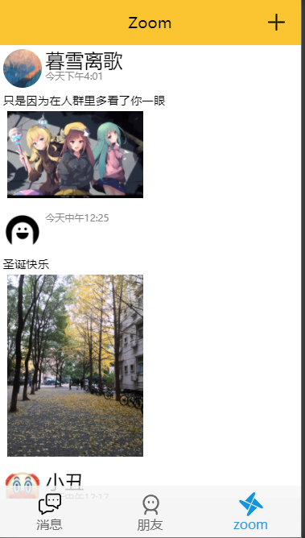

# MyQQ:一个基于egg.js和react全家桶的即时通讯移动端网页

## 项目概述：

一个具备聊天功能和空间的即时通讯软件。

源码地址：https://github.com/WHUT-XGP/chat-webapp

如果您觉得对您有帮助，请您点个star支持一下！

## 需求分析

1. 注册登录 √
2. 个人信息的完善和展示 √
3. 好友模块：好友的添加 √
4. 好友个人聊天功能 √
5. 群聊功能 
6. 空间查看功能 √
7. 空间点赞功能
8. 空间动态发布 √

## 设计参考

参考QQ：简洁模式

## 后端框架

egg.js

egg-socket.io

egg-mysql

egg-jwt

## 前端技术栈

React全家桶(react react-router react-router-config react-transition-group redux react-redux redux-thunk)

该项目采用immer作为immutable数据流的实现

axios swiper better-scroll 

## 项目预览：

为保证体验，请打开F12，使用手机模式进行预览：

预览地址：**http://47.102.212.191:7001/public/index.html**

### 如何双开预览

如果您想要双开页面，请您首先便打开两个未登录的页面：


可以使用以下账号：

- 用户名:**test1** 密码:**123**
- 用户名:**test2** 密码:**123**

ps：**swiper**库存在一个**第一次加载无法滑动**的问题，这是因为chrome浏览器pc端如果不打开touch event api，就会使用point event api，**这个问题在手机上不存在，并且可以直接通过刷新解决，如果您在预览过程中出现无法预览的情况，请您按下F5或点击刷新。**

由于本项目使用了localStorage做本地存储，所以如果您已经登录过，在另一个新标签页打开页面，则会直接跳过登录，可以通过左滑（如无法滑动，请见上文）打开用户信息界面，点击左上角的**<**进行账号注销并退出，然后再打开新页面登录新账号


### 界面展示

1. 注册与登录


在确认密码时会进行类似下图的校验：


登录后界面：

 

1. 消息（接收到的好友消息会在这里显示）

   

   当登录时存在未读消息时，则会有如下提示：

   

2. 朋友（进行好友的添加和发起聊天）

   好友列表：

   

   搜索好友（点击**+**添加)：

   

   添加和同意

   

   同意：

   

   

   同意后：点击图标可发送信息

   

   

   

   

   聊天使用了better-scroll 可以较为灵活的实现图片的滑动，另外使用了emoji-mart库作为表情包的提供，支持发送emoji哦

   

   另外还针对移动端处理了软键盘的唤起适配。

3. zoom（类似留言板）

​     zoom页面可以进行信息的发布，另外做了分页，上滑触底时，可以加载后面的分页数据，而下拉则可以加载最新数据





4. 个人信息

   

   信息编辑：

   


## 一些核心代码：

关于socket事件集中管理，用redux统一所有接口数据（除zoom页面）：

```js
// 导入相关数据的操作方法并以此进行设置redux
import { actionCreator as homeActionCreator } from '../../views/Home/store'
import { actionCreator as chatActionCreator } from '../../views/Chat/store'
// 导入store以应用dispatch
import store from '../index'
// 导入网络请求方法
import { getInfoByUserID } from '../../api/LoginRequest';
const dispatch = store.dispatch;
// 在这里获取store状态

// socket必须保证只被调用一次 在这里利用isOK变量控制
let isOk = false;
export const socketListener = (socket) => {
    // 为socket添加事件
    if (socket && !isOk) {
        isOk = true;
        console.log("事件已经绑定");
        // 监听res
        socket.on('res', (data) => {
            console.log(data)
        })
        // 监听登录响应
        socket.on('login', (data) => {
            console.log(data)
        })
        // 设置404错误监听
        socket.on('404', (data) => {
            console.log(data)
        })
        // 设置错误监听
        socket.on('error', (data) => {
            console.log(data)
        })
        // 设置用户数据
        socket.on('detail', (data) => {
            console.log(data)
            // 派发message
            dispatch(homeActionCreator.userInfoChange(data.message))
        })

        // 监听好友列表名单
        socket.on('friendList', (data) => {
            console.log(data)
            dispatch(homeActionCreator.friendListChange(data.data))
        })
        // 监听好友搜索结果
        socket.on('searchFriend', (data) => {
            console.log(data)
            dispatch(homeActionCreator.searchFriendListChange(data.message))
        })
        // 监听好友添加响应
        socket.on('addFriend', data => {
            console.log(data)
        })

        // 监听登录消息
        socket.on('loginMessage', data => {
            console.log(data)
            const unReadMessageList = data.data.obj;
            dispatch(chatActionCreator.unReadMessageListChange(unReadMessageList))
        })
        // 监听获取聊天记录
        socket.on('targetChatMessage', data => {
            // console.log(data.messageList)
            dispatch(chatActionCreator.messageListChange(data.messageList))
        })
        // 获取收到的消息
        socket.on('message', data => {
            const target = store.getState().ChatReducer.target
            const token = store.getState().LoginReducer.token
            // 正在聊天的处理
            if (target === data.dispatcher) {
                // 加入到现在正在聊天的位置
                dispatch(chatActionCreator.addMessageList(data))
            }
            // 未聊天的处理
            else {
                // 加入到未读中
                console.log("未读", data)
                // 如果在当前其消息队列
                const unReadMessageList = store.getState().ChatReducer.unReadMessageList;
                let tempUnReadMessageList = {
                    ...unReadMessageList
                }
                const userID = data.dispatcher
                if (userID in tempUnReadMessageList) {
                    console.log('userid');
                    tempUnReadMessageList[userID] = {
                        ...tempUnReadMessageList[userID],
                        count: tempUnReadMessageList[userID].count + 1,
                        lastMessage: data.messageValue,
                        ...data
                    }
                    dispatch(chatActionCreator.unReadMessageListChange(tempUnReadMessageList))
                } else {
                    console.log("不在list")
                    getInfoByUserID(userID, token).then(res => {
                        const userDetail = res.data[0]
                        if (userDetail) {
                            tempUnReadMessageList[userID] = {
                                ...tempUnReadMessageList[userID],
                                ...data,
                                ...userDetail,
                                count: 1,
                                lastMessage: data.messageValue
                            }
                            dispatch(chatActionCreator.unReadMessageListChange(tempUnReadMessageList))
                        }

                    })
                }
                // dispatch(chatActionCreator.addUnReadMessageList(data))
            }
        })
        // // 获取发送动态
        // socket.on('send', data => {
        //     console.log(data)
        // })
        // 监听获取对方信息：
        socket.on('UserDetailByUserIDs', data => {
            console.log(data)
            if (data.status) {
                let list = data.data;
                const { type } = data;
                switch (type) {
                    // 聊天中分发的
                    case 'chat':
                        dispatch(chatActionCreator.targetDetailChange(list[0]))
                        break;
                    default:
                        break;
                }
            }
        })

    }
}
```

路由动画：可见文章[实现一个路由动画跳转](https://xgpax.top/267-2/)

```jsx
import React from "react";
import { CSSTransition, TransitionGroup } from "react-transition-group";
import { Switch, Route, withRouter } from "react-router-dom";
import "./index.css";

/**
 *
 * @param {way} props
 * @description 用于页面路由跳转 通过way指定跳转方式，指定way=refade
 * 则反向
 *
 */
const ANIMATION_MAP = {
  PUSH: "fade",
  POP: "refade",
};
function AnimationGo(props) {
  const { children } = props;
  return (
    <Route
      render={({ location }) => (
        <TransitionGroup
          childFactory={(child) =>
            React.cloneElement(child, {
              classNames: ANIMATION_MAP[props.history.action],
            })
          }
        >
          <CSSTransition timeout={500} key={/**限制二级路由的动画 */location.pathname.substring(0, location.pathname.lastIndexOf('/'))}>
            <Switch location={location}>{children}</Switch>
          </CSSTransition>
        </TransitionGroup>
      )}
    ></Route>
  );
}

export default withRouter(React.memo(AnimationGo));

```

immer在项目中的应用:

```js
// 在此处编写业务逻辑并导出
import { produce } from 'immer'
// 导入动作
import { actionType } from './index'
// 初始值
const initialState = {
    // 对方userID
    target: '',
    targetDetail: {
        userID: '',
        avator: '',
        signature: '',
        nickName: '',
        birthday: '',
        gender: 1
    },
    messageList: [],
    unReadMessageList: {},
    friendList: []
}
// 编写reducer
const ChatReducer = (state = initialState, action) => {
    return produce(state, (draft) => {
        switch (action.type) {
            case actionType.TARGET:
                draft.target = action.data;
                break;
            case actionType.TARGETDETAIL:
                draft.targetDetail = action.data;
                break;
            case actionType.MESSAGELIST:
                draft.messageList = action.data;
                break;
            case actionType.INSERTONEROWMESSAGELIST:
                draft.messageList.push(action.data)
                break;
            case actionType.UNREADMESSAGELIST:
                draft.unReadMessageList = action.data;
                break;
            case actionType.CHANGECOUNT:
                {
                    const { target, count } = action.data;
                    draft.unReadMessageList[target].count = count;
                }
                break;
            case actionType.CHANGELASTMESSAGE:
                {
                    const { target, lastMessage, messageType } = action.data;
                    draft.unReadMessageList[target].lastMessage = lastMessage;
                    draft.unReadMessageList[target].messageType = messageType;
                    draft.unReadMessageList[target].messageValue = messageType;
                }
                break;
            default:
                break;
        }
    })
}
export { ChatReducer }
```

受限于篇幅，暂无法将所有核心内容贴出，之后会尽力出拆解文章，包括后端的eggjs部分。

## 项目的导入和预计准备

1. git clone https://github.com.cnpmjs.org/WHUT-XGP/chat-webapp.git

   利用cnpm进行github的克隆加速

2. clone完成后创建一个utf8,utf8_bin的myqq_server数据库：

3. 打开myqq-server目录下的app目录 找到myqq_server.sql，在myqq_server数据库中运行该sql文件。

4. 待运行完成后分别打开myqq-server目录和myqq-webapp目录，

   打开app目录下的config/config.default.js，将其中的mysql密码改为你自己的密码：

   ```js
   // mysql配置信息
     config.mysql = {
       // 单数据库信息配置
       client: {
         // host
         host: '127.0.0.1',
         // 端口号
         port: '3306',
         // 用户名
         user: 'root',
         // 密码
         password: '123456',// 修改为你自己的
         // 数据库名
         database: 'myqq_server',
       },
       // 是否加载到 app 上，默认开启
       app: true,
       // 是否加载到 agent 上，默认关闭
       agent: false,
     };
   ```

   5.自己申请七牛云的对应对象存储空间（免费）在控制台找到自己的密钥和空间名称，还有对应的七牛云接口地址（我的是华南）申请后打开对应的myqq-server/app/controller/config.js

   ```js
   
   const Controller = require('egg').Controller
   const qiniu = require('qiniu')
   class ConfigController extends Controller {
       async qiniuToken() {
           const { ctx } = this;
           // 自己的七牛云accesskey和secretKey
           const accessKey = ''
           const secretKey = ''
           const mac = new qiniu.auth.digest.Mac(accessKey, secretKey)
           // scope仓库名称(即命名空间) 从七牛云看
           const options = {
               scope: ''
           }
           const putPolicy = new qiniu.rs.PutPolicy(options)
           const token = putPolicy.uploadToken(mac)
           const key = '' + new Date() + Math.random().toString(16).slice(2);
           const data = {
               token,
               key
           }
           ctx.body = {
               code: 200,
               status: "ok",
               data
           }
       }
   }
   module.exports = ConfigController
   ```

   同时前端对应的myqq-webapp/src/api/HomeRequest.js：

   ```js
   const baseURL = 'https://img.xgpax.top/' //改为你自己的
   const apiURL = 'http://upload-z2.qiniu.com' //改为对应的接口
   ```

   

   后端运行

   ```shell
   yarn
   // or npm install
   // 完成后
   yarn dev
   // or npm run dev
   ```

   稍等一会即可在127.0.0.1:7001端口看到后端业务

   前端运行

   ```js
   yarn
   // OR npm install
   // 完成后
   yarn start
   // OR npm run start
   ```

   

#### 当前待完善部分

前端部分:

1. zoom页面待开发  √
2. 好友删除功能与添加时，对已经添加做检测
3. 好友消息通知组件重构，聊天信息本地持久化
4. 群聊功能（附加世界频道）
5. 消息/好友 为空时给定美观提示  √
6. 聊天界面弹起bug  √
7. 聊天界面发送消息后失去焦点（待完善） √
8. 聊天框弹起  √

后端部分：

1. zoom部分对应后端开发  √
2. 群聊对应部分开发

其他

1. 写后端eggjs相关的教程文章
2. 总结开发过程，完善前端
3. 对部分组件和思想进行详细的文章描述

